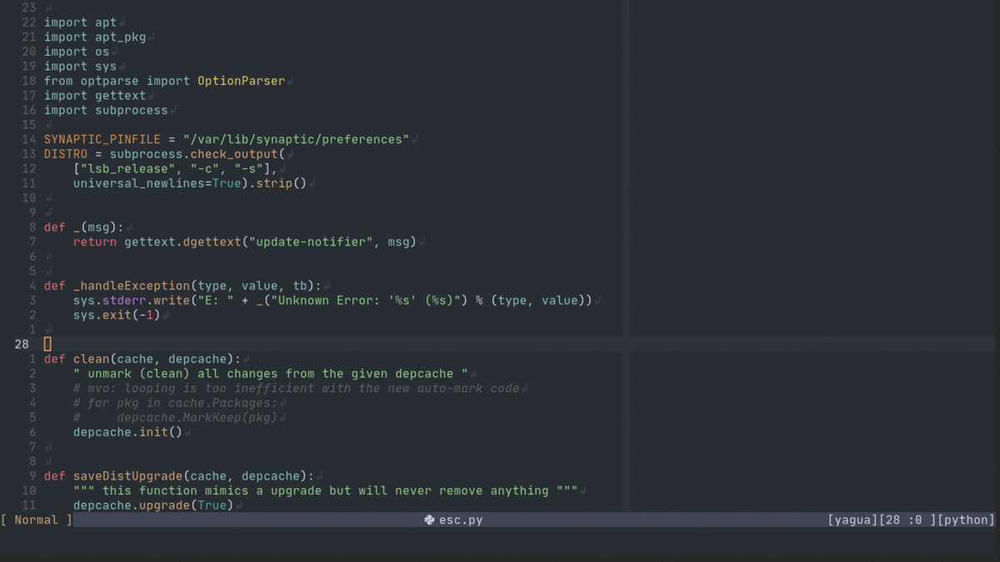

# Nebulous.nvim

```
 .    .     .         _____  .      .       *     .      0      .     .      *      .    .   ..   *
     .       .     .-'.     ':'-.                                        *       +
   .             .''   ::: .:    '.     .      '    .      .       .    '            .     |    .  .
         ,      /      :::::'      \       ()                       ()    .-.,="``"=.    - o -   .
            .  ;.   .   ':' `   .   ;    .            .      .             '=/_       \    |       .
   ,       .   |          '..       |         *                        *   |  '=._    |            .
 .             ; '  .      ::::.    ;     .                 .               \     `=./`,    .  .  *
            .   \          '::::   /   .          .               .      .   '=.__.=' `='       .   .
  .     *        '.      .  :::  .'              .       +                               .     + .
             .      '-.___'_.-'      .    O        .                O      *        '   .  .      .  .
            .              .      .    .                     .                                  .
   *   .        ****     **      .    **      .    .     **    .     .    0      *   .              .
    \     .    /**/**   /**   .      /**    .           /**  .    .                              .
     o         /**//**  /**   *****  /**       **   **  /**   ******   **   **   ****** .    +     .
      .    *   /** //** /**  **///** /******  /**  /**  /**  **////** /**  /**  **////  .             .
*      0    .  /**  //**/** /******* /**///** /**  /**  /** /**   /** /**  /** //*****   .    .      .
 .             /**   //**** /**////  /**  /** /**  /**  /** /**   /** /**  /**  /////** .           .
         \     /**    //*** //****** /******  //******  *** //******  //******  ******    .    .     .
   .      \    //      ///   //////  /////     //////  ///   //////    //////  //////         .
           \    .            .           .              .                   .          0         .
.       .   o        *            ,             .                 .           .      .      *     .   
    .      #\##\#      .                 .                   .        .-' -=;::;::`;:::`-  .     *    0
         #  #O##\###                .                      .       .-'"; `-;:"";`-;   ,;;'`-.  .
        #*#  #\##\###     0                 ()       *           .''";;:     ,..   `.;;. .';;'.    .
    .   ##*#  #\##\##               .                   .       /  ,;;::,     `--'  ,.;: ::  .;:\     .
  .      ##*#  #o##\#       *  .                0          ,   ..- .; ;:,;,,.,   ,  ;;: ::;;:..;:. .
      .     *#  #\#     .            .       .            .   ;   ;    .;::,    ;:.;:::::::::;., ;   .
                  \          .                                |;. :      ;:;       `-;:::::-'""  | .
^/\___^--____/\____O______________/\/\---/\_____/\____________| ;,'  ,;::     ;.     `-;::  `;:::|____
\^   ^  ^    ^                  ^^ ^  '\ ^          ^        ---         ---        ^
     --           -            --  -      -         ---  ___       ^   _       ^  --   -    ^    --
```


Minimalist Collection of Colorschemes Written in Lua

## Features

- 4 available variants (for the moment)
- These color schemes are compatible with LSP, Tree-Sitter, Telescope, Nvim-Tree and others.
- Support for Vim Terminal Colors
- Lualine scheme
- Color customization
- Italic elements in the editor
- They support a large number of terminal emulation environments, such as:
    - [Alacritty](https://github.com/alacritty/alacritty)
    - [Kitty](https://github.com/kovidgoyal/kitty)
    - [Tmux](https://github.com/tmux/tmux)
    - [Windows Terminal](https://github.com/microsoft/terminal)

## Prequisites

- [Neovim version 0.5+](https://github.com/neovim/neovim/releases)
- (Recommended) [Tree-Sitter](https://github.com/nvim-treesitter/nvim-treesitter) Highlight for a better use of colors

## Installation

You can install colorsecheme with any package manager, for example:

##### [Packer.nvim](https://github.com/wbthomason/packer.nvim)

```lua
use 'Yagua/nebulous.nvim'
```

##### [Vim Plug](https://github.com/junegunn/vim-plug)

```vim
Plug 'Yagua/nebulous.nvim'
```

## Configuration & Use

##### VimScript

```vim
" Put this lines inside your vimrc to set the colorscheme
colorscheme nebulous
" or
lua require("nebulous").setup()
```

##### Lua

```lua
-- Put this lines inside your vimrc to set the colorscheme
require("nebulous").setup()
--or
vim.cmd("colorscheme nebulous")
```

## Colorscheme Settings

It is important to mention that the configurations listed hereafter, have to be
set before loading the colorscheme.

##### Color variants

| Variant             | Value         |
| --------------------| --------------|
| night               | `default`     |
| twilight            | `alternative` |
| midnight            | `alternative` |
| fullmoon            | `alternative` |

More variants coming soon !!

## Preview

#### Fullmoon



#### Midnight


#### Twilight


#### Night


### Lualine scheme

If you want to use the custom colorscheme of lualine, put the following code in
your init (make sure you have nebulous and lualine installed, otherwise it may not work):

##### Lua

```lua
require('lualine').setup {
  options = {
    -- theme name
    theme = 'nebulous'
  }
}
```

## Summary of options

| Option                               | Default Value |  Description                                  |
| -------------------------------------|---------------|-----------------------------------------------|
| variant                              | `night`       | Select color variant                          |
| <b>disable</b>.background            | `false`       | Enable/Disable background in the editor       |
| <b>disable</b>.endOfBuffer           | `false`       | Enable/Disable lines at the end of the buffer |
| <b>italic</b>.comments               | `false`       | Enable/Disable "italic" style in comments     |
| <b>italic</b>.functions              | `false`       | Enable/Disable "italic" style in functions    |
| <b>italic</b>.variables              | `false`       | Enable/Disable "italic" style in variables    |
| <b>italic</b>.keywords               | `false`       | Enable/Disable "italic" style in keywords     |

Example of use:

```lua
--Nebulous Settings
require("nebulous").setup {
  variant = "midnight",
  disable = {
    background = true,
    endOfBuffer = false,
  },
  italic = {
    comments   = false,
    keywords   = true,
    functions  = false,
    variables  = true,
  },
  custom_colors = { -- this table can hold any group of colors with their respective values
    LineNr = { fg = "#5BBBDA", bg = "NONE", style = "NONE" },
    CursorLineNr = { fg = "#E1CD6C", bg = "NONE", style = "NONE" },

    -- it is possible to specify only the element to be changed
    TelescopePreviewBorder = { fg = "#A13413" },
    LspDiagnosticsDefaultError = { bg = "#E11313" },
    TSTagDelimiter = { style = "bold,italic" },
  }
}
```
More features to come in future updates

### NOTE
- In case you find an error in any color scheme, please make an appropriate issue describing in detail the problem found.
- Also, if you want to make any contribution, please make the PR descriptive for easy integration.

I hope you enjoy these color schemes!!
